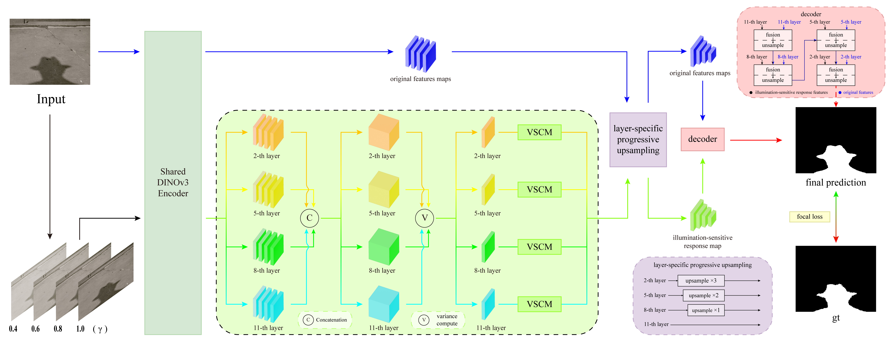

# ISSD
A Shadow Detection Framework Based on Illumination-Sensitive Modeling.

## Overview

## Datasets

In this work, we utilize five benchmark datasets for evaluation:

**(1) SBU**
The SBU dataset is available at [https://www3.cs.stonybrook.edu/~cvl/projects/shadow_noisy_label/index.html](https://www3.cs.stonybrook.edu/~cvl/projects/shadow_noisy_label/index.html).

**(2) UCF**
The UCF dataset is available at [https://drive.google.com/file/d/12DOmMVmE-oNuJVXmkBJrkfBvuDd0O70N/view](https://drive.google.com/file/d/12DOmMVmE-oNuJVXmkBJrkfBvuDd0O70N/view).

**(3) ISTD**
The ISTD dataset is available at [https://github.com/DeepInsight-PCALab/ST-CGAN](https://github.com/DeepInsight-PCALab/ST-CGAN).

**(4) SBUTestNew**
The SBUTestNew dataset is available at [https://github.com/hanyangclarence/SILT](https://github.com/hanyangclarence/SILT).

**(5) CUHK**
The CUHK dataset is not publicly available. Please contact the authors of [CUHK](https://github.com/xw-hu/CUHK-Shadow) to request access.

## Results
We provide the predicted results of our method on the benchmark datasets,
which can be downloaded from [Google Drive](https://your_link_here) / [Baidu Disk](https://your_link_here).
